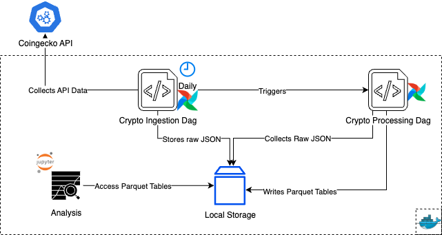

# Crypto Data Pipeline

This project ingests, processes, and analyzes cryptocurrency exchange and market data from 
[Coingecko API](https://docs.coingecko.com/v3.0.1/reference/introduction) using Apache Airflow and Jupyter Notebook
on Docker.

## Prerequisites

- Docker
- Python 3.8 or higher

## Project Architecture



**Components**:

* **CoinGecko API** – Public data source for exchanges, markets, and volumes.
* **Airflow DAGs** – Orchestrates data ingestion and processing.
  * **crypto_ingestion**: Fetches raw JSON data from the API.
  * **crypto_processing**: Cleans and transforms raw data into Parquet format.
* **Local Storage** – Stores both raw and processed datasets, partitioned by ingestion date.
* **Jupyter Notebook for Analysis** – Collects processed Parquet data for insights and visualizations.

## Setup

1. **Clone the repository and access the project**
```bash 
  git clone https://github.com/nacpacheco/crypto-exchange-data-pipeline 
  cd crypto-exchange-data-pipeline
```

2. **Start the services:**

Run the following command to start the Airflow and Jupyter services:

```bash
  docker-compose up -d
```

This command will set up the following services:
- **Airflow Webserver:** Accessible at `http://localhost:8080` with username `admin` and password `admin`.
- **Jupyter Notebook:** Accessible at `http://localhost:8888/lab?token=admintoken`
- **PostgreSQL Database:** Used by Airflow to store metadata.

3. **Verify the services are running:**
```bash
  docker-compose ps
```
This command should show the status of the services as "Up".

4. **Access the services:**
   - Airflow: Open your browser and go to `http://localhost:8080`
     - You can log in with the username `admin` and password `admin`.
   - Jupyter: Open your browser and go to `http://localhost:8888/lab?token=admintoken`

## Running the Pipeline

After accessing the Airflow web interface, you can explore and manage the DAGs.
The Airflow DAGs code are located in the `dags/` directory.
   - Enable both DAGs by toggling the switch next to their names in the Airflow web interface.
     - The `crypto_ingestion` DAG should start automatically once enabled and will run every day at 00:00 UTC to ingest new data.
     - The `crypto_processing` DAG will be triggered by the completion of the `crypto_ingestion` DAG
     - You can also check the logs of each task to monitor the execution and debug any issues.

## Performing Analysis
After the DAGs have run and data has been ingested and processed, you can use the **Jupyter notebooks** to explore and analyze the data.

Accessing the Jupyter UI at http://localhost:8888/lab?token=admintoken you can check the notebook located in the `work/` directory on the Jupyter interface,
this corresponds to the `analysis/` directory in the project root.
   - The notebook for this project `crypto_data_analysis.ipynb` contains code for data exploration and analysis.
   - You can explore the data and perform analysis using the provided notebook
   - You can run the cells in the notebook to see the results and visualize the data.

**Note:**
Data shown here takes into consideration a sample of 2025-08-10 ingestion and using the following markets as linking markets with Bitso:
* XRP/USD
* BTC/USD
* ETH/USD

It also considers the first 50 exchanges from the Coingecko API.

## Running Tests
To run the unit tests for the DAGs, you can follow these steps:

1. Create a virtual environment (optional but recommended) with the dependencies defined in `requirements.txt`:
```bash
    python -m venv venv
    source venv/bin/activate
    pip install -r requirements.txt
```

2. Run the tests using pytest:
```bash
    python -m pytest tests/
```

